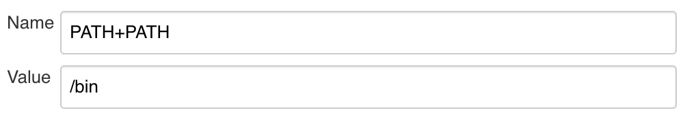

# Getting Ready for Liftoff Using Modern Application Delivery

This repository contains code with various examples of the following:

- Operating System Image Pipeline using **HashiCorp Packer**
- Infrastructure Pipeline using **HashiCorp Terraform**
- Application Pipeline using **Chef Habitat**
- Application Automation integration with Secrets Management using **Vault Terraform**
- Continuous Compliance, Hardening and Reporting using **Chef InSpec**, **Chef Infra** and **Chef Automate**

Note that the examples as well as the code used to provision the necessary infrastructure to run the examples are meant to be used in conjunction with a Powerpoint Presentation and recorded walk through that is made available with this resource.

# Preparation

You can choose to make use of existing Automate, Jenkins, and Vault infrastructure when following these examples (in which case, skip forward to "\<tool\> Setup" sections). If you need to stand up this infrastructure yourself, follow the infrastructure guide below.

## 0. Credentials

### 0.1 Setup Azure Credentials

To run the Terraform to create the infrastructure as well as run the Terraform examples in Jenkins, a [Service Principal](https://docs.microsoft.com/en-us/azure/active-directory/develop/howto-create-service-principal-portal) is required. Create a Service Principal using the documentation available for the [Terraform Provider](https://www.terraform.io/docs/providers/azurerm/auth/service_principal_client_secret.html#creating-a-service-principal-using-the-azure-cli) and export the environment variables in the shell session in which you plan to run the Terraform. Note the variables:
- `ARM_CLIENT_ID`
- `ARM_CLIENT_SECRET`
- `ARM_TENANT_ID`
- `ARM_SUBSCRIPTION_ID`

### 0.2 Github Credentials

This is used to prevent rate limiting when scanning repositories form Jenkins. Note, you may use a [token](https://help.github.com/en/github/authenticating-to-github/creating-a-personal-access-token-for-the-command-line) with `repo` access instead of a password

### 0.3 Habitat Authentication Token

This is used to authenticate with the Habitat Public Builder. Create this using the [documentation](https://www.habitat.sh/docs/using-builder/#builder-token)

## 1. Habitat Packages

A few Habitat packages must be built before the infrastructure can be provisioned, or pre-built packages under the [liftoff-modern-application-delivery](https://bldr.habitat.sh/#/pkgs/liftoff-modern-application-delivery) can be used. If you wish to build the packages under your own origin, the following are required:

- **inspec-linux-audit** is used to audit the servers and is loaded as part of the [base applications](habitat-plans/infra-linux-base-applications/Policyfile.rb)
- **infra-linux-hardening** is used to harden the servers and is loaded as part of the [base applications](habitat-plans/infra-linux-base-applications-with-hardening/Policyfile.rb)
- **infra-linux-base-applications** is used to load base applications, including **inspec-linux-audit**
- **consul** is used as a backend to Vault and is used in [infrastructure-terraform/vault](infrastructure-terraform/vault)
- **vault** is used in [infrastructure-terraform/vault](infrastructure-terraform/vault)
- **jenkins** is used in [infrastructure-terraform/jenkins](infrastructure-terraform/jenkins)

These can be built after [configuring your workstation](https://www.habitat.sh/docs/install-habitat/#configure-workstation) and running `hab pkg build <path to directory>`. Once this is complete, a **results** directory is created in the current context with a last_build.env and a .hart file. You can source the env file using `source results/last_build.env` which will set certain variables in your session, e.g.:
```bash
$ cat results/last_build.env
pkg_origin=liftoff-modern-application-delivery
pkg_name=jenkins
pkg_version=2.190.1
pkg_release=20191031141010
pkg_target=x86_64-linux
pkg_ident=liftoff-modern-application-delivery/jenkins/2.190.1/20191031141010
pkg_artifact=liftoff-modern-application-delivery-jenkins-2.190.1-20191031141010-x86_64-linux.hart
pkg_sha256sum=6f4e038651a19b98a3bc2e598d80353557c7a2cc37fbbe3fcfbfb6e5ece69bdf
pkg_blake2bsum=e0b4765026e136fa052ed9577a1e8be5cf764af301d0278201a49d88dab5d38c

$ source results/last_build.env

$ echo $pkg_name
jenkins
```

This can then be used to upload/promote the packages. Upload each of these to the **stable** channel:
```bash
$ hab pkg upload results/$pkg_artifact --channel stable
```

## 2. Infrastructure Provisioning

To prepare the environment for the examples, terraform is provided in the [**infrastructure-terraform folder**](infrastructure-terraform) and can be used to spin up required tools and infrastructure. Note that these instructions require the following to be installed:

- Packer
- Vault
- Terraform
- Habitat

The SSH keys for the tools will be made available through the output for each of the nodes.

- For Automate the credentials will be available post-deploy in **/root/automate-credentials.toml**.
- For Jenkins a randomized password is created that is included in the Terraform output (this can be run at anytime using `terraform output` after this is initially run)
- For Vault, the token is available through the Supervisor API, see "2. Vault Setup" for more information.

Keep note of these credentials, as they will also be used to provision Jenkins with the necessary access to run the examples.

### 2.2 Backend

First the terraform in the [backend folder](infrastructure-terraform/backend) must be used to create an [Azure Resource Group](https://docs.microsoft.com/en-us/azure/azure-resource-manager/resource-group-overview), Storage Account, and Storage Container used to group the infrastructure/examples resources and [Terraform Remote States](https://www.terraform.io/docs/state/remote.html). Run a `terraform init` and `terraform apply` inside this folder in a session with the Service Provider credentials exported (see 0.1).

### 2.3 Networking

Create a Virtual Private Network, Public Subnet, and DNS Zone by running the Terraform (`terraform init` & `terraform apply`) in the [networking folder](infrastructure-terraform/networking). Note the remote state for this Terraform is referenced in most other modules to specify the network and subnet.

### 2.4 Virtual Machine Image Creation

To provision the infrastructure servers, we must first create the Virtual Machine Image in Azure. Modify the variable file **centos-variables.json** inside the [packer](packer) folder to correspond to the resource group created in 2.2, then run packer as so:
```bash
$ cd packer

$ packer build -var-file=centos-variables.json azure-linux-machine-image.json
azure-arm output will be in this color.

==> azure-arm: Running builder ...
==> azure-arm: Getting tokens using client secret
...
```

This will create a Virtual Machine Image in Azure named **centos-habitat-base-applications** in unmodified scenarios. **Note:** you may also have to modify the `HAB_PACKAGE` variable if you have chosen to roll your own base applications package.

### 2.5 Bastion

Create the Bastion for the infrastructure, which acts as the [Permanent Peer](https://www.habitat.sh/docs/best-practices/#permanent-peers) for this Habitat deployment.

### 2.6 Applications (Automate, Jenkins, Vault)

Run a `terraform init` & `terraform apply` in each of the application folders, as order is no longer important. Note the following per-application requirements:
- **Automate** - An existing license may be used through the available **example.tfvars** file inside the folder by filling in the value of `automate_license` and using the `-var-file` argument (e.g. `terraform apply -var-file=example.tfvars` or modifying the default value in **variables.tf**. If a license is not used a trial license can be set up once this application is launched.
- **Jenkins** - This terraform requires a few variables which will create credentials inside Jenkins, with an example of these given in **terraform.tfvars** (see section 0 for how to create these):
  - Azure Credentials
  - Github username/password
  - Habitat Authentication Token
- **Vault** - N/A

### 3. Vault Setup

These examples require the following:
- A kv secrets engine be mounted at `secret/`
- A password for Grafana be provisioned somewhere in the `secret/` mount.
- AppRole Authentication enabled
- A Policy and Role created for Grafana
- A Token Created for Jenkins that allows creating a Secret ID for the Grafana Role

#### 3.1 Vault Authentication

To enable these, we must have access to the [vault binary](https://www.vaultproject.io/downloads.html) and correctly set up our environment variables (`VAULT_ADDR`/`VAULT_TOKEN`) to authenticate with the remote Vault instance. First export `VAULT_ADDR` to the fqdn output of the vault terraform, or a Vault endpoint if you are re-using an existing Vault instance (note, a port may be required: `export VAULT_ADDR=https://vault.test.io:8200`). Export `VAULT_TOKEN` used to authenticate with Vault; if using the included terraform this can be acquired through the use of `curl` on the command line: `curl <vault-fqdn>:9631/services/vault/default/config` in property `token`:
```json
{
  "backend": {
    "path": "vault",
    "storage": "consul"
  },
  "dev": {
    "mode": false
  },
  "listener": {
    "cluster_location": "0.0.0.0",
    "cluster_port": 8201,
    "location": "0.0.0.0",
    "port": 8200,
    "tls_disable": true,
    "type": "tcp"
  },
  "token": "<token>",
  "ui": true,
  "unseal_keys": [
    "<unseal-key-1>",
    "<unseal-key-2>",
    "<unseal-key-3>",
    "<unseal-key-4>",
    "<unseal-key-5>"
  ]
}
```
This can be done in a one-liner using [`jq`](https://stedolan.github.io/jq/):
```bash
$ export VAULT_TOKEN=$(curl --silent <vault-fqdn>:9631/services/vault/default/config | jq -r .token)
```

Now we can set up the required secrets/engines/policies.

#### 3.2 Secrets and Access

Note these steps can be skipped by making use of the included [setup-vault.sh script](infrastructure-terraform/vault/setup-vault.sh), which takes as an argument a password, uses environment variables `VAULT_ADDR` and `VAULT_TOKEN`, and requires the `vault` and `jq` binaries. Note this script may have to be adjusted if the packages or example files are modified (i.e. to read the secret at a different path), and will output a Token to be put into Jenkins (see 3.1 for more information) as a credential.

To do this manually, run the following commands.

First, enable the [Key-Value Secrets engine, version 2]( https://www.vaultproject.io/docs/secrets/kv/kv-v2.html):
```bash
$ vault secrets enable --path secret kv-v2
Success! Enabled the kv-v2 secrets engine at: secret/
```

Followed by enabling [Application Role Authentication Method)[https://www.vaultproject.io/docs/auth/approle.html]:
```bash
$ vault auth enable approle
Success! Enabled approle auth method at: approle/
```

Now, create the actual secret (make sure to replace `<password>` with a real value!) 
```bash
$ vault kv put secret/grafana password=<password>
Key              Value
---              -----
created_time     2019-10-31T12:59:59.391476391Z
deletion_time    n/a
destroyed        false
version          1
```

To make use of this secret, create a Policy for Grafana allowing read access, as well as creating a Role associated with this policy: 
```bash
$ vault policy write grafana - <<EOF
path "secret/data/grafana" {
  capabilities = [ "read" ]
}
EOF
Success! Uploaded policy: grafana

$ vault write auth/approle/role/grafana policies=grafana
Success! Data written to: auth/approle/role/grafana
```

Finally, create a policy for Terraform/Jenkins. This will allow the infrastructure pipeline to create a password and provision the example node with credentials to be able to log in as the Grafana role. Note that this *does not* have access to read the secret!
```bash
# Create Jenkins Role
$ vault policy write jenkins - <<EOF
path "auth/approle/role/grafana/role-id" {
  capabilities = [ "read" ]
}

path "auth/approle/role/grafana/secret-id" {
  capabilities = [ "create", "update" ]
}

path "auth/approle/role/grafana/secret-id-accessor/*" {
  capabilities = [ "create", "read", "update", "list" ]
}

path "auth/token/create" {
  capabilities = [ "read", "create", "update", "delete" ]
}
EOF
Success! Uploaded policy: jenkins
```

Finally, create a token associated with this Jenkins policy:
```bash
$ vault token create -policy jenkins
Key                  Value
---                  -----
token                <token>
token_accessor       <token-accessor>
token_duration       768h
token_renewable      true
token_policies       ["default" "jenkins"]
identity_policies    []
policies             ["default" "jenkins"]
```

Note, keep track of this token as this will be used to provision Jenkins in the following section!

### 4. Jenkins Setup

#### 4.1 Credentials

The included Jenkinsfiles rely on the Credentials plugin for Terraform, Vault and Habitat Builder authentication. See Sectoin 0 for how to create these, then insert these into Jenkins (Credentials > System. Select "Global Credentials" domain > Add Credentials):
- Habitat Personal Access Token (**habitat-depot-token**) of type secret-text. *Note this will have been created if you made use of the included terraform*
- Azure Credentials (**arm-client-id**, **arm-client-secret**, **arm-tenant-id**, **arm-subscription-id**), each of type secret text. See section 0 for more information. *this will have been created if you made use of the included terraform*
- Vault Token (**vault-token**) This value is used to read/write data from Vault, and is used by the Vault Terraform Provider when run through Jenkins. See the [Vault Documentation](https://www.vaultproject.io/docs/concepts/tokens.html) for more details on Tokens, and see section 3.1 for creation of this token.

#### 4.2 Environment Variables 

Once these are added, we will make use of Global Environment Variables (Manage Jenkins > Configure System) which will export these variables for every pipeline run on this Jenkins. Note that this can be overriden by an `environment` block within a Jenkinsfile, and serves as *default* values only.


Make use of this to add the following environment variables:
- **HAB_ORIGIN**
  When **HAB_ORIGIN** is exported, the Habitat build process will override the value of `pkg_origin`, allowing these examples to work without having to modify the `plan.sh` of any of the packages. Set this variable to the name of a pre-existing Origin you have access to, or [create an Origin](https://www.habitat.sh/docs/using-builder/#builder-origin) for these examples. **Note that this variable was defined in the Jenkinsfile for the Habitat package pipelines during the event, but was commented to allow for this repository to be used without having to be forked**.
- **PATH**
  Update the path to begin with `/bin`, this allows us to use bin-linked Habitat packages over System-specific executables and allows us to install dependencies for a pipeline within the pipeline itself, without effecting the rest of the system. **NOTE You cannot simply override $PATH! The correct syntax is to set Variable Name to `PATH+PATH` and value to `/bin`**!
  

  
#### 4.3 Jobs

The Jobs must be added to Jenkins, and can be done through the provided [Job DSL](infrastructure-terraform/jenkins/add-all-jobs.groovy). To use this file, create a new Freestyle project adding a build step "Process Job DSLs" (note this requires the job-dsl plugin, which is included in the Jenkins package in this repository). Select "Use the provided DSL script" within the action, and paste the contents of the script within it. Run the job and the folders/jobs for the examples should be created. 

### 5. Automate Setup

Log in. If using the included terraform, this requires you SSH to the machine with the private-key provided in the terraform output and use the credentials in **/root/automate-credentials.toml**.

# Examples

The examples below are all executed through use of Jenkins Pipelines. The pipeline code can be found in [examples](examples). 

## Example 1: Infrastructure Pipeline

Our first example consists of two individual pipelines - an operating system pipeline and an infrastructure pipeline. The first builds an Virtual Machine Image that is then used to provision the infrastructure.

### Example 1, Part 1: Operating System Pipeline

The [operating system pipeline](examples/example-1-server-provisioning/packer-pipeline) consists of a Jenkinsfile that makes use of Packer with the code found in the [packer](packer) folder. This job runs packer against the JSON image definition using the included variable file for CentOS. Note this may need to be adjusted if you are not using the `liftoff-modern-application-delivery` origin and the corresponding base OS package. This can be overriden in the job configuration by defining an environment variable `TF_VAR_variable_name`, so for `habitat_origin` this might be `TF_VAR_habitat_origin`.

Due to the need for this image to exist before Jenkins is up (to deploy Jenkins), an image was already created in section 2.4 (Virtual Machine Image Creation). This pipeline does not *need* to be run to proceed with examples, but can be used as a reference for what a continuous operating system pipeline that leverages Packer might look like.

### Example 1, Part 2: Infrastructure Pipeline

The [infrastructure pipeline](examples/example-1-server-provisioning/terraform-pipeline) defines a Jenkinsfile that uses Terraform within the same folder. Running this pipeline should result in a server being spun up with a network interface, public IP address, DNS entry and Habitat Supervisor loaded. The Supervisor will then load the base applications package, which in turn will load the audit package. The logs for this auditing can be seen through `journalctl` on the machine (the private key is output at the end of the `terraform apply`):

```bash
ssh -i <path-to-saved-private-key> centos@<machine-dns>
Last Login: <date>
[centos@server-with-base-applications ~]$ sudo journalctl -fu hab-supervisor
...
<date> <hostname> hab[PID]: inspec-linux-audit.default(0): InSpec is sleeping for x seconds
```
  
## Example 2: Application Automation

Our second example consists of two pipelines - an application build pipeline and an infrastructure pipeline. The first builds a Chef Habitat Package that is uploaded to the Habitat Public Builder and used as an input to the infrastructure pipeline that is now making use of the Terraform Habitat Provisioner.

### Example 2, Part 1: Application Build Pipeline

The [application build pipeline](examples/example-2-application-automation/habitat-package-pipeline) is a Jenkinsfile that builds and uploads a habitat package for [Grafana](habitat-plans/grafana) .

Similar to 1.1, we can override the Origin this is created under by defining a global (Manage Jenkins > Configure Jenkins > Global Properties) or job-specific environment variable `HAB_ORIGIN`. This will override the origin in `pkg_name` inside the plan file.

### Example 2, Part 2: Infrastructure Pipeline

The [infrastructure pipeline](examples/example-2-application-automation/terraform-pipeline) uses Terraform within the same folder. This pipeline provisions a server that makes use of the Terraform Habitat Provisioner to load the Chef Habitat package created in the application build pipeline. A few seconds after the pipeline runs, the Grafana application should be available at the fqdn given by the terraform output.

Note again, we may have to override `TF_VAR_habitat_origin` to override the default origin the pipeline will attempt to load the package.

## Example 3: Secrets Management

This example consists of two pipelines - an application build pipeline and an infrastructure pipeline. The first builds an updated Habitat Package, and the second provisions this package with default values for Vault integration. 

### Example 3, Part 1: Application Build Pipeline

This pipeline is similar to the one given by Example 1's Application Build Pipeline, but is building an [updated Grafana package](habitat-plans/grafana-with-vault-integration). Similar to the previous pipeline, you may have to override `HAB_ORIGIN`.

Note a minute or so after the package is uploaded the Grafana Service running on the server from Example 1 will update, however, due to the design of the updated package this service will not be reading its secrets from Vault as the vault configurations will not be set.

### Example 3, Part 2: Infrastructure Pipeline

Once more, this is an evolution of the Infrastructure Pipeline in Example 2. This pipeline will, however, also create a Secret-Id for the pre-provisioned Vault Role for Grafana and provide this to the Habitat Service Configuration.

When the server is provisioned, the Grafana service should start in the next minute or so with a password pulled from Vault.

## Example 4: Compliance
 
This example consists of a single pipeline as well as the use of the Habitat Supervisor Control Gateway to apply a configuration to the existing services loaded in our examples. Note that the hardening bit of this example may not work if you're using the pre-provisioned packages, as the latest **stable** base OS package available in the original repository will have already run hardening.

### Example 4, Part 1: Updating Configuration for InSpec Linux Audit

Within the [example's folder](examples/example-4-compliance) two separate toml files exist, to be used to update the configuration of the loaded base applications. To start off, log in to your Automate and create a Token (Settings > API Tokens) to be used to report InSpec Profile runs. Insert this token into [infra-linux-hardening-config-example.toml](examples/example-4-compliance/infra-linux-hardening-config-example.toml) along with an updated `server_url` that points to the Automate being used in this example.

Apply the configuration through the bastion for the infrastructure, which can be done through the Habitat Supervisor Control Gateway. Note this [Gateway requires a shared secret](https://www.habitat.sh/docs/using-habitat/#configuring-supervisors-for-remote-command-and-control) which can be retrieved by running `terraform output` against the Terraform for the [bastion](infrastructure-terraform/bastion). Export this token, then use the `--remote-sup` argument to `hab config apply` to apply this new configuration:

```bash
$ export HAB_CTL_SECRET="<ctl-secret>"
$ hab config apply --remote-sup <bastion-fqdn> inspec-linux-audit.default <version-number> <path-to-toml>
```

This should result in the service across all the nodes (examples and infrastructure) restarting with the new configuration, now reporting compliance data to Automate (Compliance > Reports). Note this may take a few minutes for the configuration to get propagated, the service to restart, and the compliance run to complete.

### Example 4, Part 2: Application Build Pipeline

Similar to the previous pipelines, this pipeline builds an updated version of a previous package. This pipeline builds a verison of [infra-linux-base-applications](habitat-plans/infra-linux-base-applications-with-hardening) that loads a hardening package (`infra-linux-hardening`) on each of the nodes. Tailing the log, we can see that this is accomplished through a Chef Infra Client run.

### Example 4, Part 3: Updating Configuration for Infra Linux Hardening

Similar to the InSpec service, update the configuration for the hardening package through the bastion. Create another token in Automate and fill out `infra-linux-hardening-config-example.toml`. Once again, apply this through the bastion, ensuring to re-use the session where `HAB_CTL_SECRET` was exported:

```bash
$ hab config apply --remote-sup <bastion-fqdn> infra-linux-hardening.default <version-number> <path-to-toml>
```

Within a few minutes you should see Chef Client runs start reporting under Infrastructure > Client Runs.
