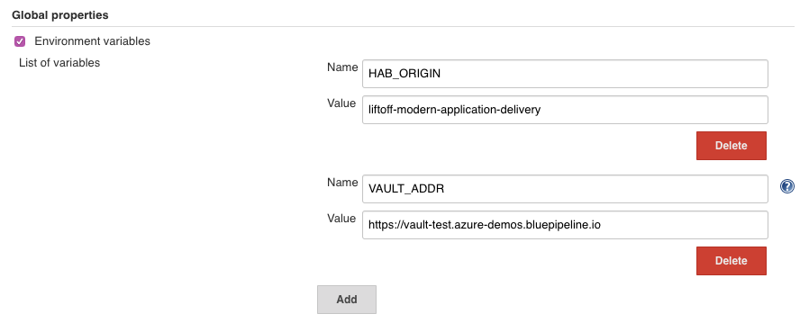

# Getting Ready for Liftoff Using Modern Application Delivery

## Running the Examples

### Preparation
Make use of an existing Automate, Jenkins and Vault if possible, or use the Terraform in the `terraform/infrastructure` folder to spin these up. The SSH keys will be made available through the output for each of the nodes.

- For Automate the credentials will be available post-deploy in `/root/automate-credentials.toml`.
- For Jenkins a randomized password is created that is included in the Terraform output
- For Vault, the token is available on the machine through the Supervisor API. This can be queries using `curl` & `jq` (you can install `jq` using `hab pkg install -b core/jq-static`) from the machine: `curl localhost:9631/services/vault/default/config | jq -r .token`

#### Jenkins Setup

##### Credentials
The included Jenkinsfiles rely on credentials for Terraform, Vault and Habitat Builder authentication. The names of these can be found in the Jenkinsfiles and can be added to existing Jenkins installations. When using the included Jenkins terraform these are pre-provisioned by providing the values for the Terraform variables.

These variables include
- Habitat Authentication Token (**HAB_AUTH_TOKEN** environment variable)
  This can be created by logging in at https://bldr.habitat.sh, then clicking the profile icon at the top right followed by the "Profile" menu item: 
  
  Scrolling to the bottom of this profile page, you can now generate or regenerate your Personal Access Token.
  
- Azure Credentials (**ARM_CLIENT_ID**, **ARM_CLIENT_SECRET**, **ARM_TENANT_ID**, **ARM_SUBSCRIPTION_ID**)
  These values represent an Azure Service Principal which allow applications such as Terraform and Packer to execute a limited set of commands instead of making use of fully privileged user credentials. See the [Microsoft Azure Documentation](https://docs.microsoft.com/en-us/cli/azure/create-an-azure-service-principal-azure-cli?toc=%2Fazure%2Fazure-resource-manager%2Ftoc.json&view=azure-cli-latest) for more information.  
- Vault Token (**VAULT_TOKEN**)
  This value is used to read/write data from Vault, and is used by the Vault Terraform Provider when run through Jenkins. See the [Vault Documentation](https://www.vaultproject.io/docs/concepts/tokens.html) for more details.

##### Environment Variables 
Once these are added, we will make use of Global Environment Variables (Manage Jenkins > Configure System) which will export these variables for every pipeline run on this Jenkins. Note that this can be overriden by an `environment` block within a Jenkinsfile, and serves as *default* values only.


Make use of this to add the following environment variables:
- **HAB_ORIGIN**
  When **HAB_ORIGIN** is exported, the Habitat build process will override the value of `pkg_origin`, allowing these examples to work without having to modify the `plan.sh`
- **VAULT_TOKEN**
  This token should have permission to create a Secret ID for the AppRole created for Grafana (see details in Vault Setup) to allow a role-id and secret-id to be correctly provisioned.
- **PATH**
  Update the path to begin with `/bin`, this allows us to use bin-linked Habitat packages over System-specific executables and allows us to install dependencies for a pipeline within the pipeline itself, without effecting the rest of the system. **NOTE You cannot simply override $PATH! The correct syntax is to set Variable Name to `PATH+PATH` and value to `/bin`**!
  

  
##### Jobs
The Jobs must be added to Jenkins, and can be done through the provided [Job DSL](infrastructure-terraform/jenkins/add-all-jobs.groovy). To use this file, create a new Freestyle project, adding a build step "Process Job DSLs" (note this requires the job-dsl plugin, which is included in the Jenkins package in this repository). Select "Use the provided DSL script" within the action, and paste the contents of the script within it. Run the job and the folders and jobs for each fo the examples should be created. 
  
#### Vault Setup
These examples require the following:
- A kv secrets engine be mounted at `secret/`
- A password for Grafana be provisioned somewhere in the `secret/` mount.
- AppRole Authentication enabled
- A Policy and Role created for Grafana
- A Token Created for Jenkins that allows creating a Secret ID for the Grafana Role

This can be easily done by making use of the included [setup-vault.sh script](infrastructure-terraform/vault/setup-vault.sh). This script takes as an argument the password, the field name, path, policyname and rolename, though only the password is a required argument with the rest having reasonable defaults. Making use of the defaults allows the examples to be used without modification. Note the script makes use of the default environment variables `VAULT_ADDR` and `VAULT_TOKEN` recognized by Vault to run the Vault commands.

Note the required policies:
```hcl
path "secret/data/grafana" {
  capabilities = [ "read" ]
}
```
```hcl
path "auth/approle/role/grafana/role-id" {
  capabilities = [ "read" ]
}

path "auth/approle/role/grafana/secret-id" {
  capabilities = [ "create", "update" ]
}

path "auth/approle/role/grafana/secret-id-accessor/*" {
  capabilities = [ "read" ]
}

path "auth/token/create" {
  capabilities = [ "read", "create", "update", "delete" ]
}
``` 

#### Automate Setup
The examples require that you create a token (Settings > API Tokens) that you may put in `default.toml` for the effortless applications, at a minimum
- habitat-plans/infra-linux-base-applications
- habitat-plans/infra-linux-base-applications-with-hardening

You may also put this in the `infra-linux-hardening` package to have Chef Client runs for hardening report back to Automate. This token can also be applied through [configuration updates](https://www.habitat.sh/docs/using-habitat/#config-updates) through Habitat, the details of which are not covered in detail as part of these examples.
